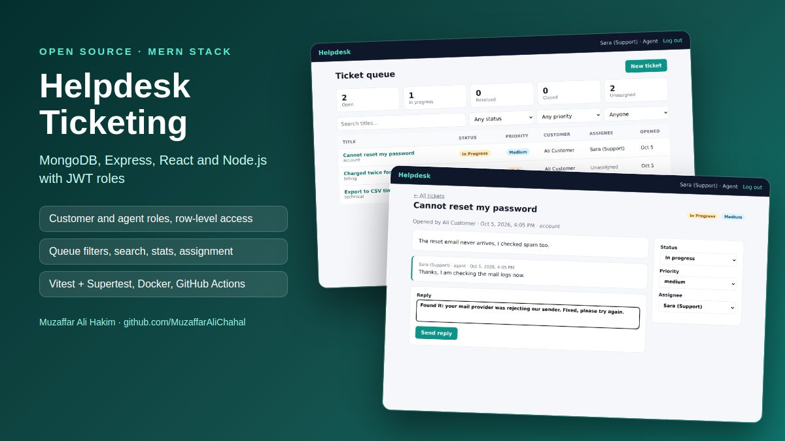
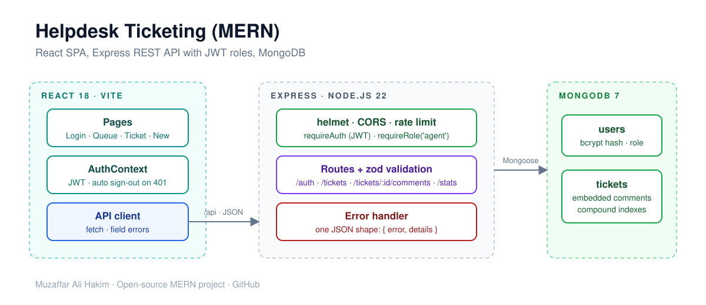

# Helpdesk Ticketing (MERN)


   

A customer-support ticketing system built with **MongoDB, Express, React and Node.js**.
Customers open tickets and talk to support; agents work a shared queue, assign tickets and track status.



## Features

- **JWT authentication** with bcrypt password hashing; self sign-up always creates a customer (a client can't make itself an agent)
- **Two roles with row-level access**: customers only ever see their own tickets (other ids return 404, so they can't be probed); agents see the whole queue
- **Ticket workflow**: open → in progress → resolved → closed. An agent reply moves a ticket to *in progress*, a customer reply reopens a *resolved* ticket, and closed tickets accept no new comments
- **Agent queue** with status counters, filters (status, priority, assigned to me / unassigned), title search (regex-escaped) and pagination
- **Validation with zod** and one error format for the whole API: `{ "error": "...", "details": { "field": "message" } }`, shown next to the right form field in React
- **Security basics**: helmet headers, CORS allow-list, rate limit on auth routes, 100 kB body limit, password hash never leaves the database
- MongoDB schema with **embedded comments** and **compound indexes** for the two main queries
- **Tests**: 18 API tests (Vitest + Supertest against a real MongoDB) and 7 React tests (Testing Library)
- **Docker**: one image builds the React app and serves it from Express; `docker compose up` starts it with MongoDB
- **GitHub Actions**: API tests with a MongoDB service, client tests and build, Docker build

## Run it

With Docker:

```bash
docker compose up --build
docker compose exec app node src/seed.js   # demo users and tickets
```

Open http://localhost:4000 and sign in as `agent@example.com` or `customer@example.com` (password `password123`).

For development (needs a local MongoDB):

```bash
cd server && cp .env.example .env && npm install && npm run seed && npm run dev
cd client && npm install && npm run dev          # http://localhost:5173, proxies /api to :4000
```

Tests:

```bash
cd server && npm test   # uses MONGO_URL if set, otherwise starts an in-memory MongoDB
cd client && npm test
```

## API

| Method | Endpoint | Who | Description |
| --- | --- | --- | --- |
| POST | `/api/auth/register` | anyone | Create a customer account, returns a JWT |
| POST | `/api/auth/login` | anyone | Returns a JWT |
| GET | `/api/auth/me` | signed in | Current user |
| GET | `/api/tickets?status=&priority=&assigned=me\|none&q=&page=&limit=` | signed in | Customers: own tickets. Agents: all |
| POST | `/api/tickets` | signed in | Open a ticket |
| GET | `/api/tickets/:id` | owner or agent | Ticket with conversation |
| PATCH | `/api/tickets/:id` | agent (customer may only close) | Status, priority, assignee |
| POST | `/api/tickets/:id/comments` | owner or agent | Reply |
| GET | `/api/tickets/stats` | agent | Counts by status, unassigned |
| GET | `/api/users/agents` | agent | Agents for assignment |

## Architecture



```
server/
├── src/
│   ├── app.js              # Express app: security middleware, routes, error handler
│   ├── models/             # Mongoose: User, Ticket (embedded comments, indexes)
│   ├── routes/             # auth, tickets, users
│   ├── middleware/         # JWT auth + roles, errors
│   ├── validation.js       # zod schemas
│   └── seed.js             # demo data
└── tests/                  # Vitest + Supertest
client/
└── src/
    ├── api.js              # fetch client, token storage, ApiError
    ├── auth.jsx            # AuthContext
    ├── pages/              # Login, Tickets, Ticket, NewTicket
    └── __tests__/          # Testing Library
```

The screenshot at the top is generated from the running app by [`scripts/readme-screenshots.mjs`](scripts/readme-screenshots.mjs) (Playwright). Run the **Update README screenshots** workflow in the Actions tab to refresh it.

## License

MIT
